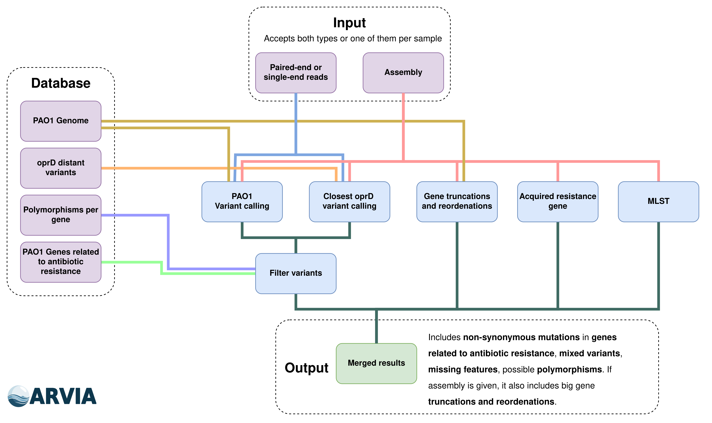

<p align="left">
  <!--  -->
  <picture>
    <source media="(prefers-color-scheme: dark)" srcset="arvia/data/arvia_header_bb.png">
    <source media="(prefers-color-scheme: light)" srcset="arvia/data/arvia_header_wb.png">
    
  </picture>
</p>

## Summary

ARVIA (**A**ntibiotic **R**esistance **V**ariant **I**dentifier for *Pseudomonas **a**eruginosa*) takes **single-end/paired-end reads (long or short)** and/or an **assembly** per sample to perform exhaustive **variant calling** of genes related to antibiotic resistance in *Pseudomonas aeruginosa*. Additionally, it can extract **acquired resistance genes** and **MLST** from assemblies. See [Usage](#usage) and [Installation](#installation) sections. Its main functions are:
- **Variant calling in PAO1**:
  - **Point mutations** (SNVs, indels, frameshifts) 
  - Possible **missing features** (e.g. lost genes due to chromosomic rearrangement).
  - Possible **truncated genes** due to big chromosomic rearrangements (only with assembly!).
  - **Mixed positions** (e.g. 50% of reads indicate C and the other 50% T).
  - Possible **polymorphisms** that do not influence antibiotic resistance.
- **Variant calling of closest oprD reference**. 
- **Acquired resistance genes** (only with assembly!).
- **MLST identification** (only with assembly!).
- Creation of **comparative tables** to more easily assess the cause of different phenotypes between samples.


<p align="center">
  
</p>


## Index
- [Usage](#usage)
- [Installation](#installation)
- [Input](#input)
  - [Input YAML convention](#input-yaml-convention)
  - [ARVIA's naming convention](#file-naming-convention)
- [Full command list](#full-command-list)
- [Citation](#citation) 


## Usage

You can run ARVIA easily with an `input.yaml` file (see [**Input YAML convention**](#input-yaml-convention)) containing the input files:

```sh
# Run ARVIA
arvia run --input_yaml input.yaml --output_folder arvia
```

If your files follow [**ARVIA's naming convention**](#file-naming-convention), you can also give them all with `--reads` and/or `--assemblies` and ARVIA will associate each file to their `sample_id`:

```sh
# Full pipeline (reads+assemblies)
arvia run --assemblies folder/*.fasta --reads folder/*.fastq.gz --output_folder arvia

# Full pipeline using only assemblies (no depth inference in variant calling)
arvia run --assemblies folder/*.fasta --output_folder arvia

# Partial pipeline using only reads (truncation information in assembly from assembly is missing)
arvia run --reads folder/*.fastq.gz --output_folder arvia
```

> [!TIP]
> You can also previsualize what the pipeline is going to do with `--previsualize`:
>```sh
># Run ARVIA
>arvia run --input_yaml input.yaml --output_folder arvia --previsualize
>```

Check out more options, like `--cores`, in the [Full command list](#full-command-list).

## Installation

> [!NOTE]
> This application has been **designed for Linux systems** and tested in **Ubuntu**.

Installation through mamba is highly recommended:

```sh
# Create main environment where ARVIA runs
mamba create -n arvia \
    snakemake==7.18.0 python=3.8 pandas==1.5.0 numpy==1.23.1 'biopython>=1.78' rich-argparse==1.6.0 'colorama==0.4.4' 'odfpy==1.4.1' 'setuptools<=70' toml==0.10.2 xlsxwriter ipykernel \
    seqkit==2.1.0 'pigz>=2.4' ncbi-amrfinderplus mlst unzip \
    perl-bioperl snippy==4.6.0 snpEff==4.3.1t bcftools=1.21 openssl==3.5.0 samtools=1.18 blast=2.16.0
    
conda activate arvia

# Install ARVIA
git clone https://github.com/Pablo-Aja-Macaya/ARVIA.git
cd ARVIA
python -m pip install -e . # "-e" allows for editable mode, else "python -m pip install ."
```

<!-- 
# Testing package updates (this one works)
mamba create -n arvia_test_env \
    'snakemake==7.18.0' 'python>=3.8.10' 'pandas>=1.5.0' 'numpy>=1.23.1' 'biopython>=1.78' 'rich-argparse>=1.6.0' 'colorama>=0.4.4' 'odfpy>=1.4.1' 'setuptools<81' xlsxwriter \
    seqkit==2.1.0 'pigz>=2.4' \
    perl-bioperl snippy==4.6.0 snpEff==4.3.1t bcftools=1.21 openssl==3.5.0 samtools=1.18 blast=2.16.0 

mamba create -n arvia_test_env \
    'snakemake==9.8.1' 'python>=3.8.10' 'pandas>=1.5.0' 'numpy>=1.23.1' 'biopython>=1.78' 'rich-argparse>=1.6.0' 'colorama>=0.4.4' 'odfpy>=1.4.1' 'setuptools<81' xlsxwriter \
    seqkit==2.1.0 'pigz>=2.4' \
    perl-bioperl snippy==4.6.0 snpEff==4.3.1t bcftools=1.21 openssl==3.5.0 samtools=1.18 blast=2.16.0 

conda activate arvia_test_env
python setup.py develop
-->

## Input

ARVIA takes **single-end/paired-end reads (long or short)** and/or an **assembly** for each sample given. Single-end reads will be considered long reads such as PacBio or Oxford Nanopore Technologies (ONT). It needs at least one of the two types of files, with a maximum of 1 assembly and 2 reads files per sample.

> [!IMPORTANT]
> Selected **pipeline depends on user input**. Every part is available for each input type except the detection of truncated genes caused by big reordenations, which requires an assembly. It is **recommended to provide reads and an assembly** for a more in-depth analysis!


### Input YAML convention

In order to use `--input_yaml` generate a YAML file with the following structure, where keys are unique sample_ids, containing one or two lists named `reads` and `assembly` with their corresponding files (path can be relative from where ARVIA is executed):

```yaml
# -- Input template --
# SAMPLE_10: # <- Will be used as ID
#   reads:
#     - path/to/blablabla_R1.fastq.gz
#     - path/to/blablabla_R2.fastq.gz
#   assembly:
#     - path/to/blablabla.fasta

# -- Your samples --
# Complete example with paired reads and assembly
ARGA00024:
  reads:
    - input/ARGA00024_R2.fastq.gz
    - input/ARGA00024_R1.fastq.gz
  assembly:
    - input/ARGA00024.fasta

# Example with only single-end long reads
# you dont need to specify assembly key if you dont have it
ARGA00461:
  reads:
    - input/ARGA00461.fastq.gz

# Example with only assembly
# you dont need to specify reads key if you dont have it
ARGA00461-a:
  assembly:
    - input/ARGA00461.fasta
```

You could also **create the YAML programatically**. Lets say you have a table `metadata.tsv`, your sample ids are in the column `sample_id` and your input files follow paths you know, the following is an example with Python:

```python
import pandas as pd
import glob
import yaml

# A tab separated table with
metadata_file = "metadata.tsv"

# The file where the YAML will be saved
input_yaml_file = "input.yaml"

# Read metadata and extract a list with your sample ids
df = pd.read_csv(metadata_file, sep="\t")
sample_ids = list(df["sample_id"].unique())

# Create a dictionary following the yaml format
d = {
    i: {
        "reads": sorted(glob.glob(f"path/to/reads/{i}/{i}_R*.fastq.gz")), # make sure both elements are lists
        "assembly": glob.glob(f"path/to/assemblies/{i}/{i}_assembly.fasta"), # make sure both elements are lists
    } for i in sample_ids
}

# Save the dictionary to YAML
with open(input_yaml_file, "w") as out_handle:
    for biosample_id, values in d.items():
        out_handle.write(f"# ---- {biosample_id} ----\n")  # section title
        yaml.dump(
            {f"{biosample_id}": values}, 
            out_handle, default_flow_style=False, sort_keys=False
        )
        out_handle.write(f"\n")
```


### File naming convention

You can see the convention expected for `--reads` and `--assemblies` with `--help`:

```sh
-r, --reads path [path ...]         Input reads files. Can be paired-end or single-end and must follow one of these
                                    structures: '{sample_id}.fastq.gz' / '{sample_id}_R[1,2].fastq.gz' /
                                    '{sample_id}_[1,2].fastq.gz' / '{sample_id}_S\d+_L\d+_R[1,2]_\d+.fastq.gz'
-a, --assemblies path [path ...]    Input assembly files. Must follow one of these structures:
                                    '{sample_id}.{fasta,fna,fa,fas}' (default: None)
```


<!-- 
## Full command list 
Full command list available with `arvia --help`:

[ ] TO-DO 
-->


## Test

In order to test ARVIA's installation, execute the following command:

```sh
arvia test --output_folder test_arvia
```

This command downloads a set of reads and assemblies and tries to run the pipeline.

## Performance

A full pipeline test of 125 P. aeruginosa samples with paired-end Illumina reads and assemblies takes around 42:57 minutes (<1 minute per sample) in a computer with 64 threads and 128 Gb of RAM.


## Citation

Please cite the database from which PAO1 genome and gene information were retrieved, **[Pseudomonas.com](https://www.pseudomonas.com)**:

Winsor GL, Griffiths EJ, Lo R, Dhillon BK, Shay JA, Brinkman FS (2016). Enhanced annotations and features for comparing thousands of Pseudomonas genomes in the Pseudomonas genome database. Nucleic Acids Res. (2016) doi: 10.1093/nar/gkv1227 (Database issue). Pubmed: 26578582

## Development

### Upload to TestPyPi

```
cd ARVIA/
conda activate twine

# Create build dist
python -m build

# Upload to TestPyPi with twine
twine upload --repository testpypi dist/*

# Now you can pip install
pip install -i https://test.pypi.org/simple/ arvia

```


<!-- 
- [] Herramienta variant calling p. aeruginosa    
    - Funciones:
        - [] Input: paired reads, long reads or assembly
        - [] Output: tabla comparativa a lo ancho (.xlsx y .tsv), tabla comparativa a lo largo (.xlsx y .tsv), informe html de igvvariant, parameter log
        - [] To-do    
            - [] automatic reference download
            - [] arreglar el print de check_truncations en ciertos casos, ejemplos:
              - [] ARGA00097 PA0929 pirR
              - [] ARGA00457 PA0427 oprM
              - [] ARGA00032 PA0424 mexR
              - [] ARGA00581 PA0929 pirR
              - [] ARGA00534 PA0929 pirR
              - [] ARGA00086 PA0424 mexR
              - [] ARGA00396 PA2057 sppR
              - [] ARGA00104 PA3721 nalC
              - [] ARGA00104 PA4522 ampD
              - [] ARGA00395 PA4109 ampR
            - [] actualizar imagen pipeline
            - [] in xlsx output check it looks good on every platform (breaks like \n dont work in windows)
            - [] añadir funcion para incrementar cores por rule si hay menos muestras
            - [] informe html de igvvariant
            - [] add approximate depth if using reads
            - [] hideable snakemake progress bar?
            - [X] cuando los genes no encajen a la perfeción (tipo blaPDC* o blaPDC?) poner el alelo más cercano
              - Ej: blaPDC* -> blaPDC-30*; blaPDC? -> blaPDC-30?
            - [X] conseguir mlst más cercano si no tiene uno definido y poner el !
            - [X] tests
            - [X] amrfinder
            - [X] mlst
            - [X] en tabla final si no ha habido ningún cambio en un gen este no aparece, arreglar y meterlo sí o sí aunque esté vacío
            - [X] quitar lo de func en la tabla de parámetros no sé qué es
            - [X] en tabla resumen si se da assembly pero no detecta la PDC lo pone como si no se le hubiese dado ensamblaje, arreglar
            - [X] añadir modelo de mlst
            - [X] añadir mlst más cercano
            - [X] in results_per_sample
                - [X] format blast table (add header at least)
                - [X] add original muts without filters

    - Dependencies:
        - python
        - snakemake
        - snippy
        - bwa
        - samtools
        - makeblastdb y blast
        - minimap2 for long reads?
        - amrfinder
        - mlst
    - Paper: https://academic.oup.com/bioinformatics/pages/instructions_for_authors
        - [] paper
        - [] cover letter
        - [] Title page
        - [] .tif files (1200 d.p.i. for line drawings and 350 d.p.i. for colour and half-tone artwork). For online submission, please also prepare a second version of your figures at low-resolution for use in the review process; these versions of the figures can be saved in .jpg, .gif, .tif or .eps 
    - Nombres
        ARVIA: Antibiotic Resistance Variant Identifier for Pseudomonas aeruginosa
        PAVRA: Pseudomonas aeruginosa Variants and Resistance Analyzer
        PAVCRA: Pseudomonas Aeruginosa Variant Calling Resistance Analysis
        PARVI: P. Aeruginosa Resistance Variant Inspector
-->

<!-- [home]: https://github.com/Pablo-Aja-Macaya/ARVIA
[installation]: https://github.com/Pablo-Aja-Macaya/ARVIA/#installation


